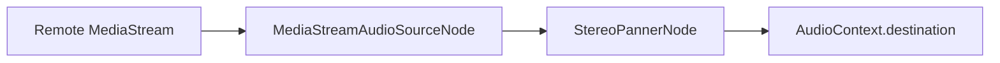

# Developer Skill Guidelines & Idioms - GIIN Meet

This document serves as the developer handbook for maintaining, debugging, and expanding the GIIN Meet codebase. Adhering to these patterns ensures type-safety, stability, and visual premiumness.

---

## 1. WebRTC Perfect Negotiation Idiom
When implementing renegotiation or screen shares:
- **Never trigger manual offers on track additions**. Rely entirely on `onnegotiationneeded` to capture track changes and dispatch signal offers.
- **Always respect the polite rollback**:
  ```typescript
  const polite = myKey < senderKey;
  const offerCollision = makingOfferRef.current[senderKey] || pc.signalingState !== 'stable';
  const ignoreOffer = !polite && offerCollision;

  if (ignoreOffer) return;
  ```
- Make sure to clear candidate buffers once the signaling state resets to `stable`.

---

## 2. Web Audio API Routing Graph
When routing remote audio streams:
1. Initialize a single, global `AudioContext` on user interaction.
2. Route streams through a `MediaStreamAudioSourceNode` and connect it to a `StereoPannerNode`.
3. Set panners' `.pan` parameter dynamically based on grid coords.
4. Mute the HTML DOM `<audio>` element (`muted={isSpatialAudioEnabled}`) to prevent double playback of remote audio.



---

## 3. Global CSS Theme Architecture
Our branding is driven by the `data-ui-style` attribute on `document.documentElement`:
- Avoid hardcoded values in component styles. Use semantic CSS variables (e.g. `var(--bg-app)`, `var(--border-color)`).
- When writing inline React styles, prioritize layouts and flex positions, leaving color schemes and drop-shadows to `index.css` selectors.
- Always call `document.documentElement.style.removeProperty` on custom variables before switching styles to ensure clean inheritance from stylesheets.

---

## 4. Collaborative Vector Canvas Drawing
To render vector whiteboard shapes (Line, Rect, Circle):
1. **Mouse Down**: Cache starting coordinate `{ x, y }`.
2. **Mouse Move**: If drawing a shape, trigger `redrawWhiteboard()` (which wipes the canvas and paints all committed vectors from memory), and then overlay the current shape preview.
3. **Mouse Up**: Commit the completed vector to the history array and broadcast the payload via Supabase Realtime Channels.

---

## 5. Security & Cryptography
- DMs (Direct Messages) are end-to-end encrypted. Standard text is converted to cipher text before Supabase inserts.
- Whispers in group channels are formatted as `[WHISPER:targetUserId:text]`. Other peers' message loaders intercept this format and return `null` if the user is neither the sender nor the target recipient.
