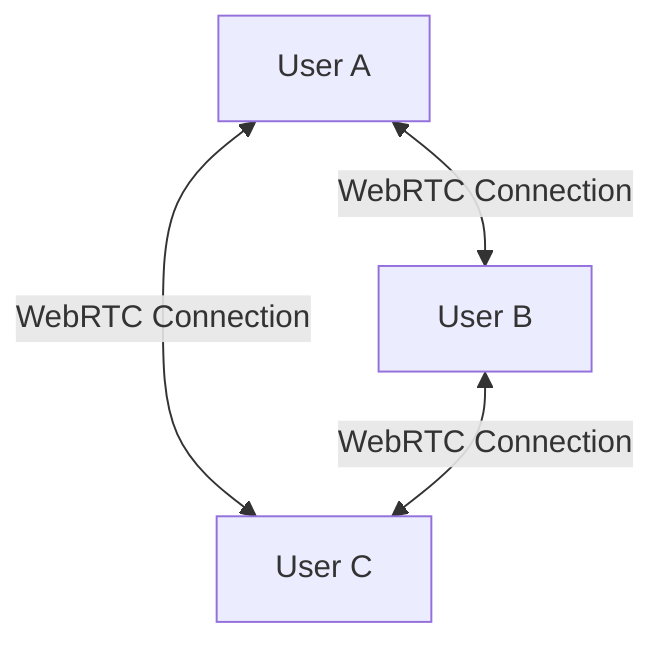

# Video Conferencing & Meeting Room Operations Guide

This document provides a detailed overview of how the video conferencing and meeting room systems in GIIN Meet operate, including the core technologies, signaling protocols, and architectural rationale.

---

## 1. Network Topology: Peer-to-Peer (P2P) Mesh
GIIN Meet utilizes a **Decentralized P2P Mesh Topology** for media distribution.



### Why Mesh?
- **Zero Server Media Costs**: Audio and video streams bypass central media servers (SFUs or MCUs), saving server bandwidth.
- **Low Latency**: Direct peer connections yield the lowest possible round-trip time (RTT).
- **Privacy**: Streams are encrypted directly from sender to receiver, meaning no intermediary server can decrypt the media payload.

---

## 2. Real-Time Signaling Infrastructure
WebRTC requires a side-channel to exchange connection metadata (SDP descriptions, ICE candidates). GIIN Meet uses **Supabase Realtime Broadcast Channels** for this purpose.

### Why Supabase Broadcast?
- **Low Latency Websockets**: Realtime channels route broadcast messages across peers with sub-100ms latency.
- **No Database Write Overhead**: Broadcast events are transient and bypass database disk writes, avoiding database locking issues.

---

## 3. WebRTC Connection Lifecycle

### 3.1 Initial Presence Discovery
1. When a participant joins, they broadcast a `join` event carrying their local user metadata.
2. The host and existing participants receive the `join` event, add the new peer to their local state grids, and prepare to establish connection paths.

### 3.2 Perfect Negotiation (Glare Resolution)
When two peers attempt to negotiate simultaneously:
- **Polite Peer** (Smaller Client ID): Yields on description collisions, rolls back its local offer, and accepts the incoming offer.
- **Impolite Peer** (Larger Client ID): Ignores incoming offers and awaits a remote answer.

This resolves WebRTC glare issues:
```typescript
const polite = myKey < senderKey;
const offerCollision = makingOfferRef.current[senderKey] || pc.signalingState !== 'stable';
const ignoreOffer = !polite && offerCollision;

if (ignoreOffer) return;
```

---

## 4. Audio Engineering: Web Audio API
Raw media streams are routed through a Web Audio node pipeline:

```
MediaStreamAudioSourceNode ──> StereoPannerNode ──> GainNode (Noise Gate) ──> AudioContext.destination
```

1. **3D Spatial Panning**: Based on a participant's horizontal grid position (offset from `-0.7` to `0.7`), the `StereoPannerNode` shifts their vocal track, creating a physical sense of layout spacing.
2. **Noise Gate Gating**: Gain levels below a user-defined threshold (e.g., `-60 dB`) are immediately zeroed, filtering out local static noise or keyboard typing sounds.
3. **Voice Modulations**: Frequency equalizers pitch-shift vocal signatures (normal, broadcast baritone, robot, studio crisp).

---

## 5. Security & Collaboration
- **Waiting Room Gating**: Unauthenticated guests request admission via the `waitroom-request` broadcast. The host admits them, sending a secure validation response payload.
- **Encrypted Whispers**: Sub-channel messages are wrapped inside `[WHISPER:targetKey:text]` formats, filtering out unauthorized visibility.
- **Vector Whiteboard Sync**: Draw events are serialized as geometric primitives and broadcasted in real-time, matching screen sizes across devices responsive to aspect ratio math.
